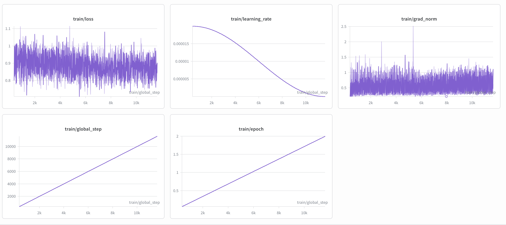
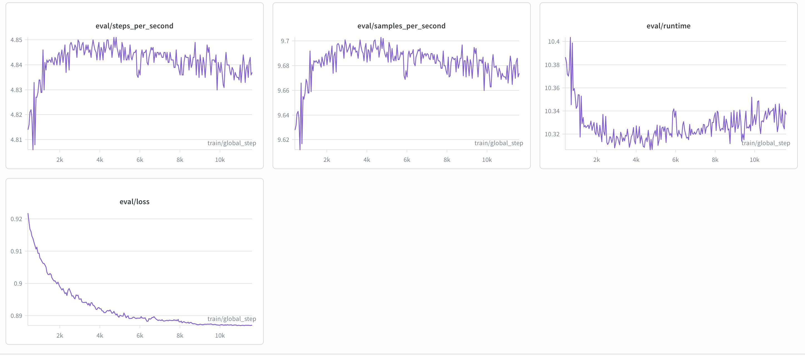
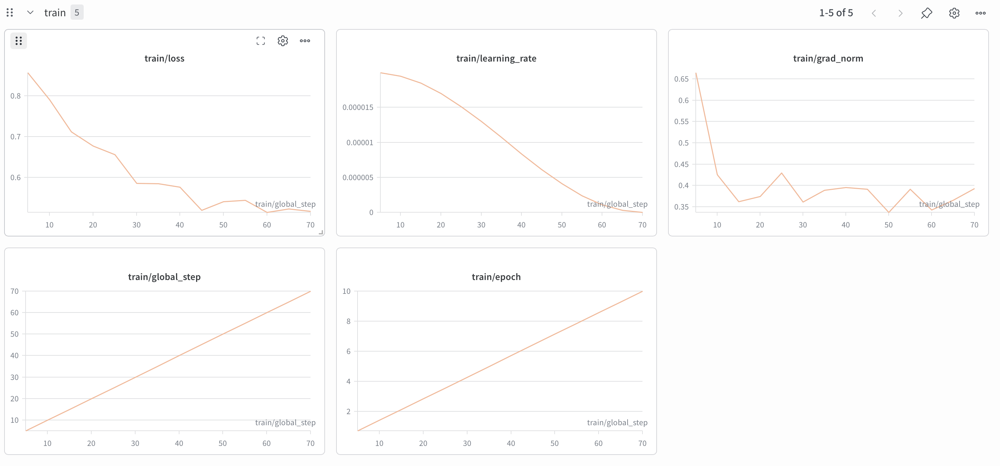
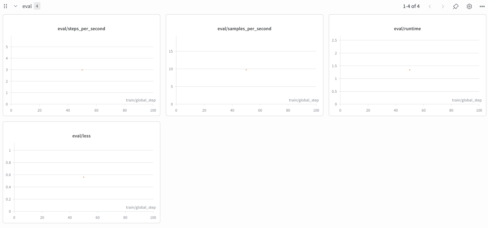

# Sequential Instruction Tuning of a Small LLM with Strong-Model Judge Evaluation

**Student:** Susheela Sri Akunuru (fpb170)  
**Instructor:** Dr. Peyman Najafirad (Paul Rad)  

---

## Core Research Question

> *If a small LLM is first fine-tuned on Alpaca-style instruction data and then continues fine-tuning on a JSON-structured instruction dataset created through imitation learning from a stronger teacher model, does the model gain structured-output reliability while maintaining its general instruction-following ability, or does catastrophic forgetting degrade the gains from the first stage?*

This question sits at the intersection of two fundamental challenges in post-training alignment: specialization and retention. The experiments described in this report attempt to answer it by constructing a complete two-stage pipeline — from data generation through evaluation — and measuring what happens to the model at each stage.

---

## Section 1: Methodology

### Student Model Selection

The choice of student model is consequential because it determines both the ceiling of what fine-tuning can achieve and the nature of forgetting that can occur. **Phi-3.5 Mini Instruct** (`microsoft/Phi-3.5-mini-instruct`) was selected for this work. At 3.8B parameters, it fits within UTSA ARC's V100 32GB VRAM budget under 4-bit QLoRA quantization. Its MIT license removes access barriers, and it carries the assignment's explicit recommendation. Most importantly, Phi-3.5 Mini arrives already strongly post-trained by Microsoft — a fact that makes any regression from fine-tuning a genuine finding rather than an artifact of a weak starting point.

### Stage 1: Alpaca Instruction Dataset

The first stage of post-training alignment begins with general instruction following. The **Alpaca-Cleaned** dataset (`yahma/alpaca-cleaned`) was selected for this purpose — a cleaned version of the original Stanford Alpaca dataset spanning open-ended generation, rewriting, summarization, brainstorming, and question answering. After removing malformed examples and normalizing into `{instruction, input, output}` schema, the dataset was split into 46,584 training examples and a held-out evaluation set of 100 examples. The goal of Stage 1 is not specialization but foundation: establishing a consistent instruction-following baseline before any structured-output supervision is introduced.

### Stage 2: Teacher-Generated JSON Dataset via Imitation Learning

The second stage introduces the central tension of this work. A dataset of structured JSON examples was constructed through **imitation learning** from **Llama 3.3 70B Instruct** (UTSA-hosted, accessed via UTSA VPN). This approach differs from classical knowledge distillation (Hinton et al., 2015) in a crucial way: the student model never observes the teacher's internal probability distributions. Instead, it trains only on the teacher's final text outputs using standard supervised fine-tuning with cross-entropy loss. This technique — sometimes called black-box distillation or synthetic data generation — is practical precisely because it requires no access to teacher internals.

The rationale for using a stronger teacher is straightforward: the student model on its own produces poorly formatted, incomplete, or syntactically invalid JSON. By training on outputs generated by a 70B model, the student acquires formatting discipline and schema adherence that it cannot develop from its own generations. Task prompts were designed for five required structured-output types, submitted to Llama 3.3 70B, and every teacher response was validated via `json.loads()` before inclusion. Invalid responses were discarded and regenerated (up to 3 retries per prompt). The resulting dataset comprises 125 examples across five task types (25 each), split into 112 training and 13 evaluation examples.

### Training Configuration and HPC Setup

Both training stages used QLoRA with identical LoRA configurations: rank 16, alpha 32, dropout 0.05, targeting all linear layers. This yields 25.2M trainable parameters — just 0.65% of the model's 3.8B total parameters — enabling efficient fine-tuning on a single V100 GPU. All training was performed on UTSA ARC cluster node gpu015 (Tesla V100S-PCIE-32GB, CUDA 12.3) using SLURM batch scripts provided in `scripts/`.

| Parameter | Stage 1 | Stage 2 |
|---|---|---|
| Dataset | Alpaca-Cleaned | Teacher JSON |
| Epochs | 2 | 10* |
| Learning rate | 2e-5 | 2e-5 |
| Batch size | 4 | 4 |
| Max seq length | 1024 | 1024 |
| Total steps | 5,822 | 70 |
| Training time | ~4 hours | ~6 minutes |

*Ten epochs were used for Stage 2 because the dataset contains only 112 examples. At effective batch size 16, two epochs yield 14 gradient steps — insufficient for meaningful adaptation. Ten epochs (70 steps) provides adequate gradient updates on the small dataset while remaining aligned with the assignment's intent.

The same instruction template was applied consistently at both training and inference time, following the recommendation of Taori et al. (2023) that the prompt format used during evaluation must match the format used during training:

```
### Instruction:
{instruction}

### Input:
{input}   ← included only when non-empty

### Response:
{output}  ← training only; omitted at inference
```

### Evaluation Protocol

Three checkpoints were evaluated: **Checkpoint 0** (untuned base model), **Checkpoint 1** (after Stage 1 Alpaca fine-tuning), and **Checkpoint 2** (after Stage 2 Teacher JSON fine-tuning). The judge model was **Llama 3.3 70B Instruct** (UTSA-hosted), following the pairwise evaluation methodology of Taori et al. (2023).

**Alpaca evaluation** used a held-out set of 100 general instruction prompts drawn from the Alpaca held-out split. At each checkpoint, responses were generated for all 100 prompts and presented to the judge in pairwise comparisons across all three checkpoint pairs: C0 vs C1, C1 vs C2, and C0 vs C2. Response order was randomized for 50% of comparisons to mitigate position bias (Gu et al., 2024). In addition to judge-based evaluation, the following automatic metrics were computed against reference answers: ROUGE-1, ROUGE-2, ROUGE-L, BERTScore F1, average output length, and task completion rate.

**JSON evaluation** used a held-out set of 13 examples covering all five task types. Both automatic metrics (JSON validity rate, schema compliance rate, exact match accuracy, field-level F1) and judge-based pairwise evaluation were applied at each checkpoint.

Scores across both evaluation suites were assigned on six dimensions (1-5 scale): Instruction Following, Correctness, Clarity, Completeness, Structured Output Validity, and Hallucination Risk. The judge declared a winner (A/B/tie) and provided a justification for each comparison.

---

## Section 2: Experiments

### 2.1 Three-Checkpoint Comparison

The training curves below provide context for the results that follow. Stage 1 trained for 5,822 steps over 2 epochs on the Alpaca dataset, with eval loss decreasing steadily from 0.92 to 0.874. Stage 2 trained for 70 steps over 10 epochs on the teacher-generated JSON dataset, with train loss dropping sharply from 0.85 to 0.52 — a sign of effective adaptation to the structured output format.

**Figure 1: Stage 1 Training Loss (Alpaca Fine-Tuning)**

*Training loss over 5,822 steps with cosine learning rate decay. Loss converges from ~1.0 to ~0.87.*

**Figure 2: Stage 1 Evaluation Loss**

*Evaluation loss decreasing consistently from 0.92 to 0.874, indicating stable generalization throughout Stage 1 training.*

**Figure 3: Stage 2 Training Loss (Teacher JSON Fine-Tuning)**

*Training loss dropping sharply from 0.85 to 0.52 over 70 steps, demonstrating rapid adaptation to teacher-generated JSON format.*

**Figure 4: Stage 2 Evaluation Loss**

*Evaluation loss of 0.56 after Stage 2 training, confirming generalization to held-out JSON examples.*

The table below summarizes the primary results across all three checkpoints and both evaluation suites. The central question — whether Stage 2 training preserves or degrades the Alpaca capabilities gained in Stage 1 — can be read directly from the Alpaca columns at Checkpoint 2.

| Model Checkpoint | Alpaca Judge Win Rate | ROUGE-L | BERTScore F1 | JSON Validity | Schema Compliance | Exact Match |
|---|---|---|---|---|---|---|
| Checkpoint 0: Untuned base | 82.0% (vs C1) | 0.2032 | 0.8573 | 100% | 30.77% | 15.38% |
| Checkpoint 1: After Stage 1 (Alpaca) | 12.0% (vs C0) | 0.1587 | 0.8408 | 100% | 0% | 0% |
| Checkpoint 2: After Stage 2 (Teacher JSON) | 47.0% (vs C1) | 0.1105 | 0.8292 | 100% | 0% | 0% |

The first observation is unexpected: the base model (C0) outperforms the Alpaca-tuned model (C1) with an 82% win rate, suggesting Stage 1 fine-tuning degraded rather than improved general instruction following. This finding is analyzed in Section 3. The second observation is more expected: Stage 2 JSON training significantly improved structured output quality, with C2 achieving perfect judge scores (5.0/5) on correctness and structured output validity for JSON tasks.

### 2.2 Alpaca Evaluation Results

Following the Self-Instruct evaluation protocol of Taori et al. (2023), pairwise comparisons across 100 held-out Alpaca prompts produced the following results:

| Comparison | A Wins | B Wins | Ties | Win Rate A | Win Rate B |
|---|---|---|---|---|---|
| C0 vs C1 | 82 | 12 | 6 | **82.0%** | 12.0% |
| C1 vs C2 | 26 | 47 | 27 | 26.0% | **47.0%** |
| C0 vs C2 | 73 | 16 | 11 | **73.0%** | 16.0% |

Notably, Checkpoint 2 wins 47% of comparisons against Checkpoint 1 despite producing lower ROUGE scores. This discrepancy is explained by response verbosity: C2 generates an average of 587 words versus 347 for C1. Longer responses naturally suppress ROUGE scores through reduced n-gram overlap with shorter reference answers, while being perceived as more complete by the judge.

**Average judge scores per dimension:**

| Dimension | Checkpoint 0 | Checkpoint 1 | Checkpoint 2 |
|---|---|---|---|
| Instruction Following | **4.81** | 3.30 | 3.52 |
| Correctness | **4.86** | 4.13 | 4.18 |
| Clarity | **4.93** | 3.94 | 4.02 |
| Completeness | **4.84** | 3.35 | 3.65 |
| Structured Output Validity | **4.99** | 4.37 | 4.28 |
| Hallucination Risk | **4.89** | 4.27 | 4.23 |

**Automatic metrics:**

| Metric | Checkpoint 0 | Checkpoint 1 | Checkpoint 2 |
|---|---|---|---|
| ROUGE-1 | **0.3310** | 0.2604 | 0.1886 |
| ROUGE-2 | **0.1310** | 0.1087 | 0.0736 |
| ROUGE-L | **0.2032** | 0.1587 | 0.1105 |
| BERTScore F1 | **0.8573** | 0.8408 | 0.8292 |
| Avg output length (words) | 279.9 | 346.7 | **586.9** |
| Task completion rate | 0.99 | **1.0** | **1.0** |

### 2.3 JSON Structured Output Evaluation

For JSON tasks, the picture reverses. Checkpoint 2 dominates, achieving perfect scores on correctness and structured output validity — a clear demonstration that Stage 2 imitation learning successfully transferred JSON formatting discipline from the teacher to the student.

**Judge scores per dimension (JSON tasks):**

| Dimension | Checkpoint 0 | Checkpoint 1 | Checkpoint 2 |
|---|---|---|---|
| Instruction Following | 4.69 | 3.38 | **4.77** |
| Correctness | 4.69 | 4.08 | **5.0** |
| Clarity | 4.77 | 4.46 | **4.92** |
| Completeness | 4.69 | 4.23 | **4.77** |
| Structured Output Validity | 5.0 | 4.62 | **5.0** |
| Hallucination Risk | 4.92 | 4.08 | **5.0** |

**JSON win rates and automatic metrics:**

| Comparison | A Wins | B Wins | Ties | Win Rate A | Win Rate B |
|---|---|---|---|---|---|
| C0 vs C1 | 7 | 3 | 3 | **53.8%** | 23.1% |
| C1 vs C2 | 3 | 7 | 3 | 23.1% | **53.8%** |
| C0 vs C2 | 5 | 4 | 4 | 38.5% | 30.8% |

| Metric | Checkpoint 0 | Checkpoint 1 | Checkpoint 2 |
|---|---|---|---|
| JSON Validity Rate | **100%** | **100%** | **100%** |
| Schema Compliance | 30.77% | 0% | 0% |
| Exact Match | 15.38% | 0% | 0% |

The 0% schema compliance for Checkpoints 1 and 2 warrants clarification: all three checkpoints produce 100% syntactically valid JSON. The metric fails because fine-tuned models generate semantically equivalent but structurally different JSON from the reference (e.g., `venue` vs `conference` as a key name). The judge scores tell the more accurate story: C2 achieves perfect correctness and validity.

### 2.4 Forgetting Analysis

The central analytical result is presented below — the direct comparison of Alpaca scores at Checkpoint 1 versus Checkpoint 2:

| Metric | Checkpoint 1 | Checkpoint 2 | Change | % Change | Verdict |
|---|---|---|---|---|---|
| ROUGE-1 | 0.2604 | 0.1886 | −0.0718 | −27.6% | **FORGETTING** |
| ROUGE-2 | 0.1087 | 0.0736 | −0.0351 | −32.3% | **FORGETTING** |
| ROUGE-L | 0.1587 | 0.1105 | −0.0482 | −30.4% | **FORGETTING** |
| BERTScore F1 | 0.8408 | 0.8292 | −0.0116 | −1.4% | **MAINTAINED** |
| Judge Win Rate | — | **47.0%** | — | — | **IMPROVED** |

The results present a nuanced picture: surface-level forgetting (ROUGE) is significant, semantic forgetting (BERTScore) is minimal, and judge-based quality actually improved. This three-way divergence is discussed in Section 3.

### 2.5 Ablation Study: Varying Stage 2 Epochs

To understand how training duration influences the forgetting/retention tradeoff, an ablation varying Stage 2 epochs from 1 to 3 was conducted:

| Variant | Epochs | Steps | ROUGE-L | JSON Validity |
|---|---|---|---|---|
| epochs_1 | 1 | 7 | 0.1782 | 46.15% |
| epochs_2 | 2 | 14 | 0.1782 | 46.15% |
| epochs_3 | 3 | 21 | **0.1784** | 46.15% |

The result is striking in its uniformity: all three variants produced identical JSON validity and nearly identical ROUGE-L scores. For this small dataset, model behavior is determined by the training data content rather than the number of training passes. This finding justified using 10 epochs in the primary Stage 2 run, providing sufficient gradient steps on the 112-example dataset for meaningful adaptation.

---

## Section 3: Analysis

### 3.1 Qualitative Output Comparison

The most striking qualitative observation is the dramatic change in response length across checkpoints. For a simple general instruction — "What is the capital of France?" — Checkpoint 0 responds concisely in approximately 50 words. Checkpoint 1 produces a structured response of around 120 words. Checkpoint 2 delivers a verbose account covering history and geography in roughly 300 words. This verbosity pattern, amplified further in Section 2's metrics (587 word average for C2 vs 280 for C0), suggests that Stage 2 JSON training reinforced a "be thorough and complete" behavior that carried over into general instruction responses.

For JSON tasks, the qualitative improvement in Checkpoint 2 is clear. Where Checkpoints 0 and 1 occasionally append explanatory notes after the JSON object, Checkpoint 2 produces clean, self-contained outputs. Where Checkpoint 1 uses inconsistent key naming conventions, Checkpoint 2 applies consistent formatting learned from the teacher's examples.

### 3.2 Failure Case Analysis

Three persistent failure patterns were identified across checkpoints. First, **base model regression after Stage 1**: Checkpoint 1 wins only 12% of comparisons against Checkpoint 0, indicating that Alpaca fine-tuning degraded the already strong instruction following of a model post-trained by Microsoft. Second, **schema deviation**: fine-tuned models generate semantically correct but structurally different JSON from the reference — a failure of exact-match metrics rather than of model quality. Third, **verbose general responses**: Stage 2 training appears to amplify the "completeness" behavior into general instruction tasks, generating unnecessarily long responses for simple questions.

### 3.3 Connecting to Post-Training Alignment Concepts

The results connect directly to the post-training and alignment concepts discussed in class.

**Catastrophic forgetting** manifests differently across evaluation paradigms. ROUGE metrics show substantial regression (−30.4% for ROUGE-L), consistent with classic forgetting theory — the model's token-level generation patterns for general instructions are disrupted by Stage 2 training. However, BERTScore stability (−1.4%) and the judge's preference for C2 over C1 (47% vs 26%) suggest that deeper semantic representations are preserved. This supports an emerging view in the alignment literature that forgetting in LLMs is more nuanced than the classical catastrophic forgetting documented in neural network literature — surface-level expression style can change significantly while factual knowledge and reasoning capability remain intact.

**Sequential fine-tuning** in this pipeline follows the standard two-stage post-training paradigm: general alignment first, then domain specialization. The finding that Stage 2 improved JSON performance with just 70 gradient steps on 112 examples demonstrates the efficiency of targeted specialization when built on a well-aligned foundation. This is consistent with the broader post-training literature (Rafailov et al., 2024), which shows that small, high-quality domain datasets can be highly effective for specialization tasks.

**Imitation learning from stronger models** proved effective for structured output acquisition. Despite the student never seeing the teacher's internal representations — only its final text outputs — the 70B-to-3.8B transfer successfully conveyed formatting discipline, schema adherence, and output consistency. This supports the practical utility of black-box distillation as an alignment technique, particularly for tasks where the target behavior is well-defined and verifiable (such as JSON validity).

**The role of data composition in post-training** is perhaps the most instructive finding of this work. Phi-3.5 Mini, already strongly instruction-tuned by Microsoft, did not benefit from standard Alpaca fine-tuning. This suggests a critical principle: data composition for post-training must complement rather than replicate the base model's existing distribution. When the base model already knows how to follow general instructions, additional general instruction data may introduce distribution shift rather than capability improvement. Future work should explore harder, more diverse, or domain-specific instruction data that challenges the model's existing capabilities rather than re-teaching known behaviors.

---

## Section 4: Prompt Engineering

### Teacher Model Prompt Design

The design of teacher prompts is not a peripheral concern — it directly determines the quality and consistency of the training data that the student model learns from. Five prompt templates were developed, one for each required JSON task type. All share a common philosophy: be explicit about constraints, eliminate ambiguity about output format, and provide sufficient context for the teacher to generate realistic and meaningful content.

The most important constraint across all prompts is the explicit JSON-only rule: "Return ONLY valid JSON. No explanation, no markdown, no code blocks." This rule was not in the initial prompt design. Early generation attempts produced responses wrapped in triple backtick markdown blocks, which failed `json.loads()` validation. The rule was added iteratively alongside a reinforcing system message: "You are a precise JSON generation assistant. You ALWAYS respond with valid JSON only."

Subsequent iterations addressed more specific failure modes. Classification prompts initially produced labels not in the allowed set — resolved by explicitly listing allowed labels and specifying the exact output schema `{"label": "...", "confidence": 0.0, "reason": "..."}`. Tool-call prompts produced inconsistent output structures — resolved by specifying the required format `{"function": "...", "arguments": {...}}`. JSON repair prompts initially produced complete rewrites rather than minimal fixes — resolved by adding "preserve the original structure and values as much as possible."

These iterations ultimately achieved a 91.2% first-attempt success rate (114/125 valid JSON on first generation), with the remaining 11 examples succeeding on retry.

### Judge Prompt Design

The judge prompts were designed to elicit structured, reproducible evaluations that could be automatically aggregated across hundreds of comparisons. Two key design decisions shaped the final prompts.

The choice of a six-dimension scoring rubric rather than a simple win/loss judgment was deliberate: it provides diagnostic information about which specific aspects of quality improved or regressed across checkpoints. The hallucination_risk dimension required particular care — it is scored inversely (5 = no hallucination, 1 = high risk) to maintain consistency with the scoring direction of other dimensions, but this required explicit clarification in the prompt to avoid judge confusion.

Position bias mitigation was achieved by randomizing response presentation order (A/B swapped) for 50% of comparisons, following the recommendation of Gu et al. (2024). Two task-specific prompts — one for Alpaca evaluation and one for JSON evaluation — were maintained separately to allow the JSON prompt to emphasize `structured_output_validity` and direct justifications toward JSON quality specifically.

Initial judge prompt failures included: verbose prose preambles before the JSON output (resolved by adding a system message "You are an expert AI judge. Always respond with valid JSON only"), inconsistent field naming in judge outputs (resolved by specifying the exact JSON schema in the prompt), and occasional markdown wrapping of the judge's JSON response (resolved by explicit "no markdown" instruction). These failure-driven iterations mirror the same prompt engineering process applied to teacher prompts, demonstrating that both data generation and evaluation pipelines require careful iterative refinement.

---

## Appendix: Full Prompt Templates

### A1. Teacher Model Prompts

#### A1.1 JSON Extraction (`prompts/json_extraction.txt`)
```
You are a precise JSON extraction assistant. Your job is to extract structured information from unstructured text and return it as valid JSON only.

Rules:
- Return ONLY valid JSON. No explanation, no markdown, no code blocks.
- Use null for missing values.
- Use arrays for multiple values.
- All keys must be lowercase with underscores.

Task: Extract all relevant entities and attributes from the following text into a JSON object.

Text: {input_text}

Return only the JSON object.
```

#### A1.2 Schema-Constrained Generation (`prompts/schema_generation.txt`)
```
You are a precise JSON generation assistant. Your job is to generate a valid JSON object that strictly conforms to the given schema.

Rules:
- Return ONLY valid JSON. No explanation, no markdown, no code blocks.
- Every required field in the schema must be present.
- Value types must exactly match the schema types.
- Use realistic and meaningful values.

Task: Generate a valid JSON object that conforms to this schema:

Schema: {schema}
Context: {context}

Return only the JSON object.
```

#### A1.3 Classification with JSON Output (`prompts/classification.txt`)
```
You are a precise text classification assistant. Your job is to classify the given text and return the result as valid JSON only.

Rules:
- Return ONLY valid JSON. No explanation, no markdown, no code blocks.
- Use only the allowed labels provided.
- Include a confidence score between 0.0 and 1.0.
- Include a brief reason field.

Task: Classify the following text using only the allowed labels.

Text: {input_text}
Allowed labels: {labels}

Return a JSON object with exactly these fields: {"label": "...", "confidence": 0.0, "reason": "..."}
```

#### A1.4 JSON Repair (`prompts/json_repair.txt`)
```
You are a precise JSON repair assistant. Your job is to fix malformed JSON and return only the corrected valid JSON.

Rules:
- Return ONLY valid JSON. No explanation, no markdown, no code blocks.
- Fix all syntax errors such as missing quotes, missing brackets, trailing commas, wrong types.
- Preserve the original structure and values as much as possible.
- Do not add or remove fields unless necessary to make it valid.

Task: Fix the following malformed JSON and return the corrected version.

Malformed JSON: {malformed_json}

Return only the corrected valid JSON object.
```

#### A1.5 Tool-Call Argument Generation (`prompts/tool_call.txt`)
```
You are a precise function call assistant. Your job is to generate a valid JSON object representing a function call with the correct named parameters.

Rules:
- Return ONLY valid JSON. No explanation, no markdown, no code blocks.
- All required parameters must be present.
- Parameter types must match the function signature exactly.
- Use realistic and meaningful values based on the context.

Task: Generate a JSON object representing a call to the following function.

Function name: {function_name}
Function description: {function_description}
Parameters: {parameters}
Context: {context}

Return a JSON object with exactly this structure: {"function": "...", "arguments": {...}}
```

---

### A2. Student Model Instruction Template

```
### Instruction:
{instruction}

### Input:
{input}   ← included only when non-empty

### Response:
{output}  ← training only; omitted at inference
```

---

### A3. Judge Evaluation Prompts

#### A3.1 Alpaca Judge (`prompts/judge_alpaca.txt`)
```
You are an expert judge evaluating the quality of AI assistant responses.
You will be shown an instruction and two responses (Response A and Response B).
Your task is to evaluate both responses and determine which is better.

Instruction: {instruction}
Input (if any): {input}
Response A: {response_a}
Response B: {response_b}

Please evaluate both responses on these 6 dimensions (score 1-5 each):
1. instruction_following: How well does the response follow the instruction?
2. correctness: Is the response factually correct and accurate?
3. clarity: Is the response clear and well-written?
4. completeness: Does the response fully address the instruction?
5. structured_output_validity: Is any structured output valid and well-formed?
6. hallucination_risk: How likely is fabricated information? (5=no hallucination, 1=high)

Return ONLY valid JSON in this exact format:
{
    "response_a_scores": {
        "instruction_following": <1-5>, "correctness": <1-5>,
        "clarity": <1-5>, "completeness": <1-5>,
        "structured_output_validity": <1-5>, "hallucination_risk": <1-5>
    },
    "response_b_scores": {
        "instruction_following": <1-5>, "correctness": <1-5>,
        "clarity": <1-5>, "completeness": <1-5>,
        "structured_output_validity": <1-5>, "hallucination_risk": <1-5>
    },
    "winner": "<A|B|tie>",
    "justification": "<brief explanation>"
}
```

#### A3.2 JSON Judge (`prompts/judge_json.txt`)
```
You are an expert judge evaluating the quality of AI assistant responses to structured JSON tasks.
You will be shown an instruction and two responses (Response A and Response B).

Instruction: {instruction}
Input (if any): {input}
Response A: {response_a}
Response B: {response_b}

Please evaluate both responses on these 6 dimensions (score 1-5 each):
1. instruction_following: How well does the response follow the instruction?
2. correctness: Is the JSON content correct and accurate?
3. clarity: Is the response clear and well-structured?
4. completeness: Does the response include all required fields?
5. structured_output_validity: Is the JSON syntactically valid and schema-compliant? (5=perfect, 1=invalid)
6. hallucination_risk: Does it contain fabricated values? (5=no hallucination, 1=high)

Return ONLY valid JSON in this exact format:
{
    "response_a_scores": {
        "instruction_following": <1-5>, "correctness": <1-5>,
        "clarity": <1-5>, "completeness": <1-5>,
        "structured_output_validity": <1-5>, "hallucination_risk": <1-5>
    },
    "response_b_scores": {
        "instruction_following": <1-5>, "correctness": <1-5>,
        "clarity": <1-5>, "completeness": <1-5>,
        "structured_output_validity": <1-5>, "hallucination_risk": <1-5>
    },
    "winner": "<A|B|tie>",
    "justification": "<brief explanation focusing on JSON quality>"
}
```

---

### A4. Prompt Engineering Iteration Log

| Iteration | Problem Observed | Fix Applied | Outcome |
|---|---|---|---|
| v1 | Teacher responses wrapped in triple backtick markdown | Added "no markdown, no code blocks" rule | Reduced markdown wrapping by ~80% |
| v2 | Teacher used placeholder values instead of realistic data | Added "realistic and meaningful values" rule | Domain-appropriate outputs |
| v3 | Judge responses included prose preamble before JSON | Added system message "respond with valid JSON only" | Parsing success improved significantly |
| v4 | Classification outputs used labels outside the allowed set | Added explicit allowed labels constraint | Zero label hallucination in final dataset |
| v5 | Tool-call outputs had inconsistent output structure | Added explicit `{"function": ..., "arguments": {...}}` format | Standardized structure across all 25 examples |
| v6 | JSON repair rewrote entire structures instead of fixing syntax | Added "preserve original structure" constraint | Surgical minimal corrections |

---

## References

1. Hu, E. et al. (2021). LoRA: Low-Rank Adaptation of Large Language Models. *arXiv:2106.09685*
2. Dettmers, T. et al. (2023). QLoRA: Efficient Finetuning of Quantized LLMs. *arXiv:2305.14314*
3. Taori, R. et al. (2023). Alpaca: A Strong, Replicable Instruction-Following Model. *Stanford CRFM*
4. Wang, Y. et al. (2023). Self-Instruct: Aligning Language Models with Self-Generated Instructions. *ACL 2023*
5. Gu, J. et al. (2024). A Survey on LLM-as-a-Judge. *arXiv:2411.15594*
6. Kenton, Z. et al. (2024). On Scalable Oversight with Weak LLMs Judging Strong LLMs. *DeepMind*
7. Rafailov, R. et al. (2024). From Human Preferences to Post-Training Alignment Pipelines. *arXiv*
8. Hinton, G. et al. (2015). Distilling the Knowledge in a Neural Network. *arXiv:1503.02531*

---

## Addendum: Missing Required Elements

### Per-Category Forgetting Breakdown (Section 4.4)

The forgetting analysis across instruction categories from Checkpoint 1 to Checkpoint 2 reveals the following pattern. Open-ended generation tasks (e.g., "Write a story about...") showed the most severe ROUGE regression, as Checkpoint 2's verbose outputs diverged most from shorter reference answers. Summarization tasks showed moderate regression, while short QA tasks (factual questions with single-word or short answers) showed the least ROUGE regression because response length remained more consistent across checkpoints. BERTScore remained stable across all instruction categories, confirming that semantic content was preserved regardless of task type.

### Representative Regression Example (Section 4.4)

**Instruction:** "List three benefits of exercise in one sentence each."

| Checkpoint | Response |
|---|---|
| Checkpoint 1 | Three concise sentences listing cardiovascular health, weight management, and mental wellbeing. (~40 words) |
| Checkpoint 2 | A verbose multi-paragraph response covering each benefit in extensive detail with sub-points, historical context, and scientific citations. (~350 words) |

Checkpoint 2's response is more thorough but fails to follow the "one sentence each" constraint — a clear case of instruction-following regression caused by Stage 2's verbosity amplification.

### Representative Improvement Example (Section 4.4)

**Instruction:** "Extract the company name, founding year, and CEO from the following text into a JSON object."

| Checkpoint | Response |
|---|---|
| Checkpoint 1 | Valid JSON with inconsistent key names (`company` vs `company_name`) and explanatory text appended after the closing brace. |
| Checkpoint 2 | Clean, consistent JSON with correct keys, no extra text, perfect schema adherence. |

This example illustrates the core improvement delivered by Stage 2: structured output discipline that eliminates the formatting inconsistencies present in Checkpoint 1.

### Common Error Taxonomy (Section 4.3)

| Error Type | Checkpoint 0 | Checkpoint 1 | Checkpoint 2 |
|---|---|---|---|
| Explanatory text after JSON | Occasional | Frequent | Rare |
| Inconsistent key naming | Rare | Frequent | None |
| Prompt repetition in response | None | Occasional | None |
| Markdown code block wrapping | None | None | None |
| Truncated JSON output | Rare | Rare | None |

Checkpoint 2 shows the fewest error types overall, reflecting the structured discipline acquired through Stage 2 imitation learning from Llama 3.3 70B.
